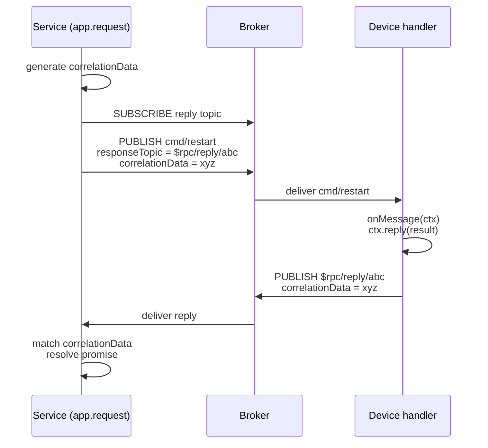

# RPC

mqttkit implements MQTT 5 request/response over `responseTopic` + `correlationData`. The service side calls `app.request(topic, payload, options?)` and awaits a reply; the device side handles the message with a `topic({ onMessage })` handler that calls `ctx.reply(payload)`.

`@mqttkit/aedes` forwards the MQTT 5 publish properties (`responseTopic`, `correlationData`, `contentType`, `messageExpiryInterval`, `userProperties`, `payloadFormatIndicator`) required to make round-trips work.

## Round-trip



The service-side `app.request()` resolves with the device's reply payload, or rejects with `RpcTimeoutError` if no matching `correlationData` arrives in time.

## Options

```ts
type RpcRequestOptions = {
  /** Per-attempt timeout in ms. Defaults to 5_000. */
  timeout?: number
  /** QoS for the outbound publish. */
  qos?: 0 | 1 | 2
  /** Retries on RpcTimeoutError. Defaults to 0. */
  retries?: number
  /** Delay (ms) between retries. Defaults to 0. */
  retryDelay?: number
}
```

The total wall-clock budget with retries is `(retries + 1) * timeout + retries * retryDelay`.

## Retries

`retries` only re-issues the request on `RpcTimeoutError`. Any other error — broker failure, `onBeforePublish` throwing, app shutdown — propagates immediately so non-idempotent commands are not multiplied:

```ts
import { RpcTimeoutError } from '@mqttkit/core'

try {
  const { payload } = await app.request('devices/alpha/cmd', 'restart', {
    timeout: 500,
    retries: 2,
    retryDelay: 200,
  })
  console.log('device acked:', payload.toString())
} catch (err) {
  if (err instanceof RpcTimeoutError) {
    // gave up after 3 attempts (initial + 2 retries)
  } else {
    throw err
  }
}
```

::: warning Idempotency
Even with the timeout-only retry guard, the first attempt may have been delivered to the device — the timeout just means the *reply* did not come back in time. Make the command handler idempotent (e.g. dedupe by `correlationData` or by an application-level request ID), or set `retries: 0` for commands that must fire exactly once.
:::

If you need exponential backoff, jitter, or `AbortSignal` integration, wrap `app.request` with a library such as [`p-retry`](https://github.com/sindresorhus/p-retry) externally; mqttkit deliberately keeps the built-in policy to fixed-delay retry on timeout only.

## Example

See [`examples/rpc`](https://github.com/keyp-dev/mqttkit/tree/main/examples/rpc) for a runnable end-to-end demo, including a "flaky downstream" that succeeds only after the third attempt.
