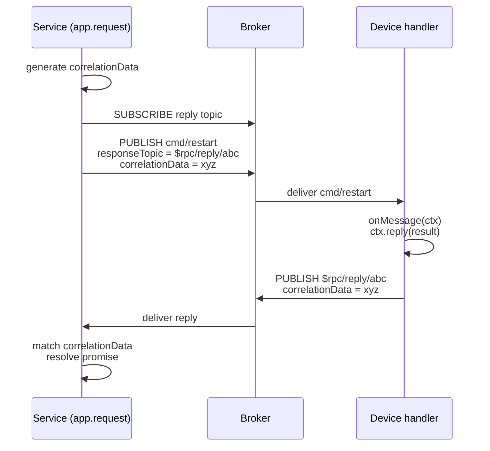

# RPC

::: tip Coming soon
This page is a placeholder while the full guide is written. See the [`@mqttkit/core` README — RPC](https://github.com/keyp-dev/mqttkit/blob/main/packages/core/README.md#rpc) for current reference material.
:::

mqttkit implements MQTT 5 request/response over `responseTopic` + `correlationData`. The service side calls `app.request(topic, payload, { timeout })` and awaits a reply; the device side handles the message with a `topic({ onMessage })` handler that calls `ctx.reply(payload)`.

`@mqttkit/aedes` forwards the MQTT 5 publish properties (`responseTopic`, `correlationData`, `contentType`, `messageExpiryInterval`, `userProperties`, `payloadFormatIndicator`) required to make round-trips work.

## Round-trip

The service-side `app.request()` resolves with the device's reply payload, or rejects with a timeout if no matching `correlationData` arrives in time.

## Example

See [`examples/rpc`](https://github.com/keyp-dev/mqttkit/tree/main/examples/rpc) for a runnable end-to-end demo.
