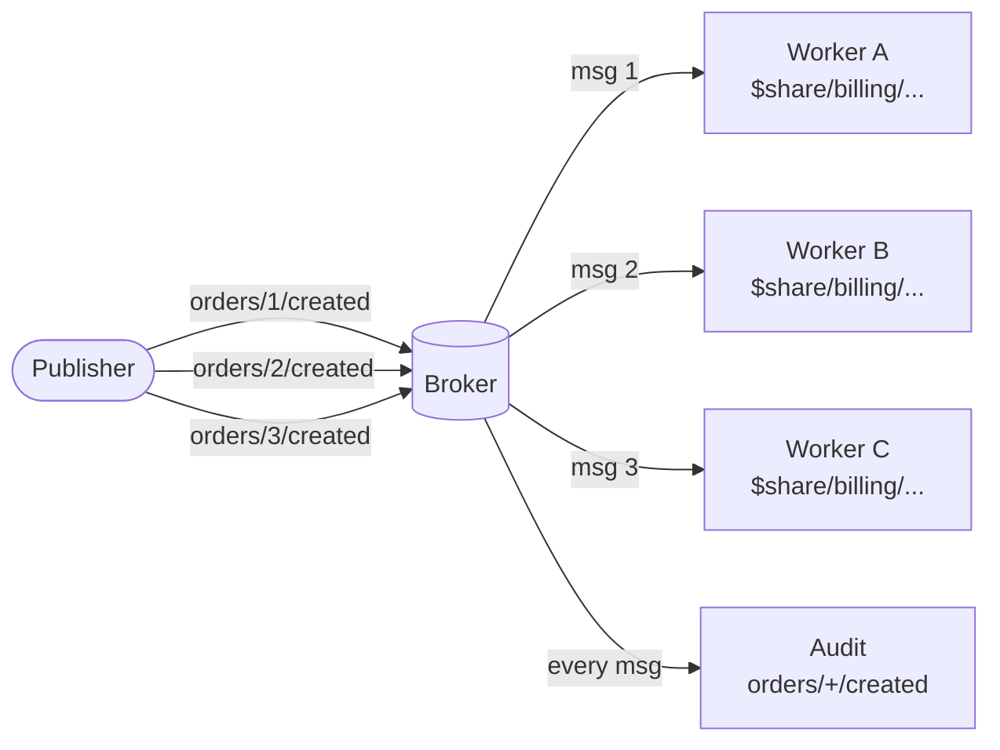

# Shared Subscriptions

mqttkit recognises MQTT 5 shared subscriptions (`$share/<group>/<filter>`) at the policy layer. The broker (Aedes) handles fan-out and group-level load balancing; mqttkit decodes the prefix, matches the route against the stripped filter, and exposes the share group to your subscribe policy.

This lets you deploy multiple instances of an mqttkit consumer behind a single MQTT broker without any custom load-balancing logic.

## Fan-out behaviour

A normal subscription fans out to every subscriber; a shared subscription competes within the group so the broker hands each message to exactly one member.



The `billing` group splits the stream three ways; the plain `orders/+/created` audit subscriber still sees every message.

## How clients subscribe

```ts
import mqtt from 'mqtt'

const client = mqtt.connect('mqtt://broker.example.com:1883')
client.subscribe('$share/billing/orders/+/created')
```

Every member of group `billing` competes for messages on `orders/+/created`. The broker delivers each message to exactly one member of the group.

## How the server matches

```ts
router().topic('orders/:id/created', {
  subscribe: ({ shared, principal }) => {
    if (shared) {
      // Restrict which services may share-subscribe to this stream.
      return ['billing', 'fulfillment'].includes(shared.group)
    }
    return Boolean(principal?.uid)
  },
})
```

- `shared` is `undefined` for a normal subscription.
- `shared.group` is the parsed share name.
- `topic` and `params` in the policy input are derived from the **stripped** filter (`orders/+/created`), so route matching is uniform.

## Group name validation

`parseSharedSubscription` follows MQTT 5 §4.8.2:

- Group name must be non-empty.
- Group name must not contain `/`, `+`, or `#`.
- Topic filter after the group must be non-empty.

Anything that fails these rules falls through as a normal subscription.

## Manual parsing

`parseSharedSubscription` is exported in case you want to inspect raw subscription input yourself (for logging, audit, or adapter code):

```ts
import { parseSharedSubscription } from '@mqttkit/core'

parseSharedSubscription('$share/g1/a/+/b') // { group: 'g1', topic: 'a/+/b' }
parseSharedSubscription('a/+/b') // null
```
