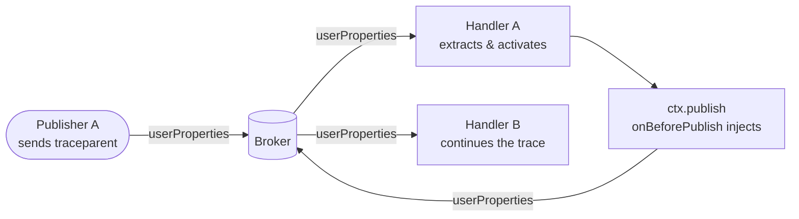

# Tracing & User Properties

mqttkit exposes MQTT 5 user properties on both inbound and outbound sides so you can wire distributed tracing (OpenTelemetry W3C `traceparent`, Datadog `x-datadog-*`, custom correlation IDs) without touching adapter-specific packet internals.

## Inbound: `ctx.userProperties`

Every dispatched context carries `userProperties?: Record<string, string | string[]>` — a flat read view of `packet.properties.userProperties`. It is `undefined` when the publisher did not attach any.

```ts
router().topic('telemetry/:id', {
  onMessage(ctx) {
    const traceparent = ctx.userProperties?.traceparent
    if (typeof traceparent === 'string') {
      // hand off to OTel propagator…
    }
  },
})
```

## Outbound: `app.onBeforePublish(hook)`

Hooks fire immediately before every outbound publish — both `app.publish()` and `ctx.publish()` / `ctx.reply()`, since those funnel through the same code path. The hook receives a mutable view:

```ts
type MqttBeforePublishContext = {
  topic: string
  payload: MqttPayload
  options: PublishOptions   // always a fresh shallow copy
}
```

Mutate `options` in place — typical use is merging into `options.properties.userProperties`.

```ts
app.onBeforePublish((c) => {
  c.options.properties = {
    ...c.options.properties,
    userProperties: {
      ...c.options.properties?.userProperties,
      traceparent: currentTraceparent(),
    },
  }
})
```

Hooks run in registration order. A throw aborts the publish; the error surfaces through `onError` with `phase: 'publish'`, and the broker is never called.

## OpenTelemetry example

OTel's W3C context propagation uses `AsyncLocalStorage`, so the active context naturally follows `await` boundaries from a handler into any nested publish. Pair an inbound middleware (extract + activate) with a single outbound hook (inject) and your MQTT round-trips show up in the same trace as your HTTP / DB spans.

```ts
import { context, propagation, trace } from '@opentelemetry/api'

const tracer = trace.getTracer('mqttkit')

const app = new MqttApp()
  .use(aedes({ tcp: { port: 1883 } }))
  // Inbound: extract → start span → bind active context for the whole handler.
  .use(async (ctx, next) => {
    const parent = propagation.extract(context.active(), ctx.userProperties ?? {})
    const span = tracer.startSpan(
      `mqtt ${ctx.route?.pattern ?? ctx.topic}`,
      { kind: 1, attributes: { 'mqtt.topic': ctx.topic, 'mqtt.client_id': ctx.clientId } },
      parent,
    )
    try {
      await context.with(trace.setSpan(parent, span), () => next())
    } catch (err) {
      span.recordException(err as Error)
      throw err
    } finally {
      span.end()
    }
  })
  // Outbound: inject the active context into every publish that goes through app.publish.
  .onBeforePublish((c) => {
    const carrier: Record<string, string> = {}
    propagation.inject(context.active(), carrier)
    if (Object.keys(carrier).length === 0) return
    c.options.properties = {
      ...c.options.properties,
      userProperties: { ...c.options.properties?.userProperties, ...carrier },
    }
  })
  .use(router().topic('devices/:uid/events', {
    async onMessage(ctx) {
      await ctx.publish(`server/${ctx.params.uid}/ack`, 'ok')
    },
  }))
```

Because `context.with()` binds the OTel context to the awaited handler, the nested `ctx.publish()` call ends up running inside the same active context, and the `onBeforePublish` hook reads `traceparent` from `context.active()`. Two consumers wired the same way will see a continuous distributed trace across the broker.

## Roundtrip



## Notes

- The hook signature is intentionally narrow: no `ctx` is passed. Carry per-request state through `AsyncLocalStorage` (OTel uses this internally; correlation-ID middleware can use the Node `AsyncLocalStorage` directly).
- Hooks see the *resolved* topic but not the *route pattern*. For tagging spans with the route pattern, do it in the inbound middleware where `ctx.route?.pattern` is available.
- `app.request()` and `ctx.reply()` both go through `app.publish()`, so RPC traces are propagated automatically once the hook is registered.
