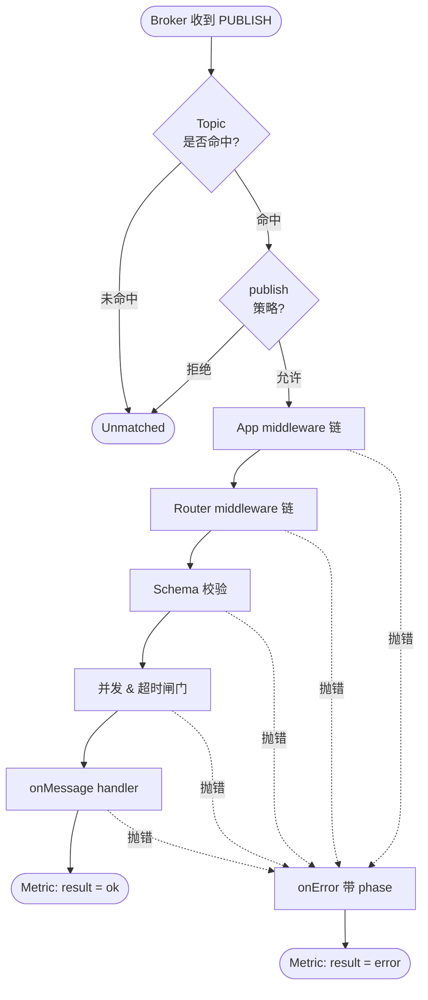

# 快速开始

mqttkit 用 `MqttApp`、有序 `use()` middleware 和 `router().topic()` 组织 MQTT 应用。协议连接、QoS、retain、session 和 persistence 由 broker adapter 负责。

## 安装

```bash
bun add @mqttkit/core @mqttkit/aedes aedes
```

## 创建应用

```ts
import { aedes } from '@mqttkit/aedes'
import { MqttApp, router } from '@mqttkit/core'

const app = new MqttApp()
  .use(aedes({ tcp: { port: 1883 }, ws: { port: 8888, path: '/mqtt' } }))
  .use(async (ctx, next) => {
    console.log(ctx.clientId, ctx.topic)
    await next()
  })
  .use(
    router()
      .topic('devices/:uid/events', {
        async onMessage(ctx) {
          console.log(ctx.params.uid, ctx.payload.toString())
          await ctx.publish(`server/${ctx.params.uid}/echo`, ctx.payload)
        },
      })
      .topic('server/:uid/echo'),
  )

await app.listen()
```

## Topic route

`topic(pattern, config)` 同时声明 publish policy、subscribe policy 和 inbound message handler。

```ts
router()
  .topic('devices/:uid/events', {
    publish: ({ params, principal }) => params.uid === principal?.uid,
    subscribe: false,
    async onMessage(ctx) {
      await ctx.publish(`server/${ctx.params.uid}/commands`, ctx.payload)
    },
  })
  .topic('server/:uid/commands', {
    publish: false,
    subscribe: ({ params, principal }) => params.uid === principal?.uid,
  })
```

默认策略：

- 有 `onMessage`：默认允许 client publish，默认不允许 subscribe。
- 无 `onMessage`：默认不允许 client publish，默认允许 subscribe。

## Dispatch pipeline

每条入站 PUBLISH 都走同一条流水线，每个阶段都可能短路掉后面的环节；任何抛错都会被 `onError` 捕获并带上对应的 phase 标签。



## Middleware

`use()` 按注册顺序执行。

```text
app middleware -> route middleware -> onMessage
```

middleware 不调用 `next()` 时，后续 middleware 和 handler 不会继续执行。

```ts
new MqttApp()
  .use(async (ctx, next) => {
    if (!ctx.clientId) return
    await next()
  })
  .use(
    router()
      .use(async (ctx, next) => {
        if (ctx.params.uid === 'blocked') return
        await next()
      })
      .topic('devices/:uid/events', { onMessage }),
  )
```

## 服务注入

用 `decorate()` 注入业务依赖，handler 通过 `ctx.services` 使用。

```ts
const app = new MqttApp<{ services: { audit: AuditService } }>()
  .decorate('audit', audit)
  .use(
    router<{ services: { audit: AuditService } }>().topic('devices/:uid/events', {
      async onMessage(ctx) {
        await ctx.services.audit.write(ctx.topic, ctx.payload)
      },
    }),
  )
```

## 运行示例

```bash
bun install
bun run --cwd examples/aedes-basic dev
```

然后用 mqtt.js、MQTTX、Mosquitto CLI 或其他标准 MQTT client 连接。
