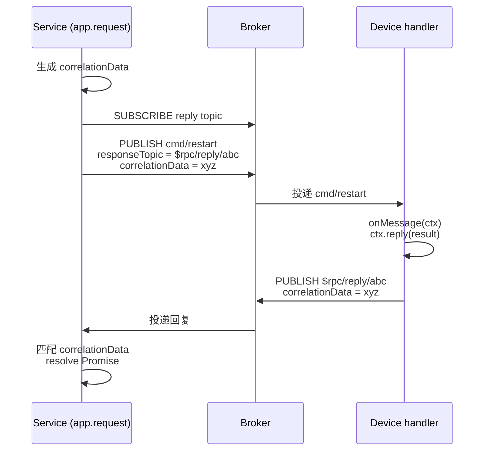

# RPC

mqttkit 基于 MQTT 5 的 `responseTopic` + `correlationData` 实现 request/response。服务端调用 `app.request(topic, payload, options?)` 并等待回复；设备端通过 `topic({ onMessage })` handler 处理消息，并调用 `ctx.reply(payload)` 回复。

`@mqttkit/aedes` 会透传 RPC 所需的 MQTT 5 publish properties（`responseTopic`、`correlationData`、`contentType`、`messageExpiryInterval`、`userProperties`、`payloadFormatIndicator`）。

## 调用往返



Service 侧的 `app.request()` 会带着设备的回复 payload 兑现，超时窗口内没有等到匹配的 `correlationData` 则以 `RpcTimeoutError` 拒绝。

## Options

```ts
type RpcRequestOptions = {
  /** 单次尝试的超时（ms），默认 5_000。 */
  timeout?: number
  /** 出站 publish 的 QoS。 */
  qos?: 0 | 1 | 2
  /** RpcTimeoutError 时的重试次数，默认 0。 */
  retries?: number
  /** 两次重试之间的延迟（ms），默认 0。 */
  retryDelay?: number
}
```

带重试时的总耗时上界为 `(retries + 1) * timeout + retries * retryDelay`。

## 重试

`retries` **只**在收到 `RpcTimeoutError` 时重新发起请求。其它错误——broker 失败、`onBeforePublish` 抛错、应用关停——都立即向上传播，避免对非幂等命令做重复投递：

```ts
import { RpcTimeoutError } from '@mqttkit/core'

try {
  const { payload } = await app.request('devices/alpha/cmd', 'restart', {
    timeout: 500,
    retries: 2,
    retryDelay: 200,
  })
  console.log('device acked:', payload.toString())
} catch (err) {
  if (err instanceof RpcTimeoutError) {
    // 3 次尝试（首次 + 2 次重试）后放弃
  } else {
    throw err
  }
}
```

::: warning 幂等性
即使有超时-only 的重试守卫，第一次尝试的请求**可能已经投递到设备**了——超时只是说*回复*没在窗口内回来。请把 command handler 写成幂等的（例如按 `correlationData` 去重，或用业务层 request ID），或者对必须只触发一次的命令显式设置 `retries: 0`。
:::

如果需要指数退避、jitter 或 `AbortSignal`，请在外层用 [`p-retry`](https://github.com/sindresorhus/p-retry) 之类的库包裹 `app.request`；mqttkit 内置策略刻意只做"超时-only + 固定间隔"。

## 示例

参考 [`examples/rpc`](https://github.com/keyp-dev/mqttkit/tree/main/examples/rpc) 中的端到端示例，里面有一个"前两次会超时、第三次才成功"的不稳定下游用来演示重试。
