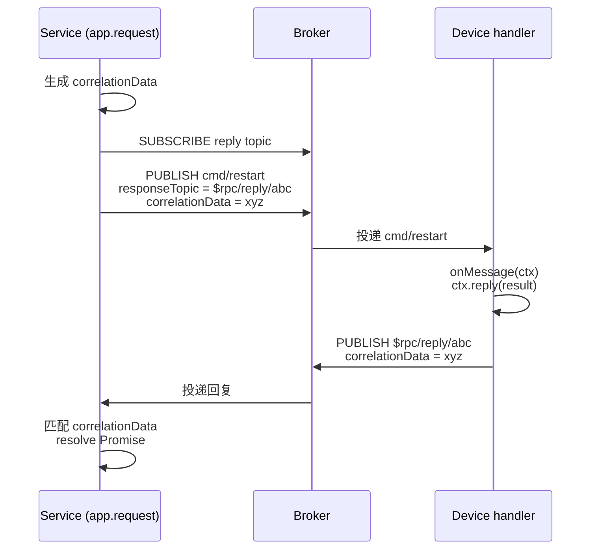

# RPC

::: tip 完整指南正在编写中
本页为占位页。当前请参考 [`@mqttkit/core` README — RPC](https://github.com/keyp-dev/mqttkit/blob/main/packages/core/README.zh-CN.md#rpc) 获取详细信息。
:::

mqttkit 基于 MQTT 5 的 `responseTopic` + `correlationData` 实现 request/response。服务端调用 `app.request(topic, payload, { timeout })` 并等待回复；设备端通过 `topic({ onMessage })` handler 处理消息，并调用 `ctx.reply(payload)` 回复。

`@mqttkit/aedes` 会透传 RPC 所需的 MQTT 5 publish properties（`responseTopic`、`correlationData`、`contentType`、`messageExpiryInterval`、`userProperties`、`payloadFormatIndicator`）。

## 调用往返

Service 侧的 `app.request()` 会带着设备的回复 payload 兑现，超时窗口内没有等到匹配的 `correlationData` 就以超时拒绝。

## 示例

参考 [`examples/rpc`](https://github.com/keyp-dev/mqttkit/tree/main/examples/rpc) 中的端到端示例。
