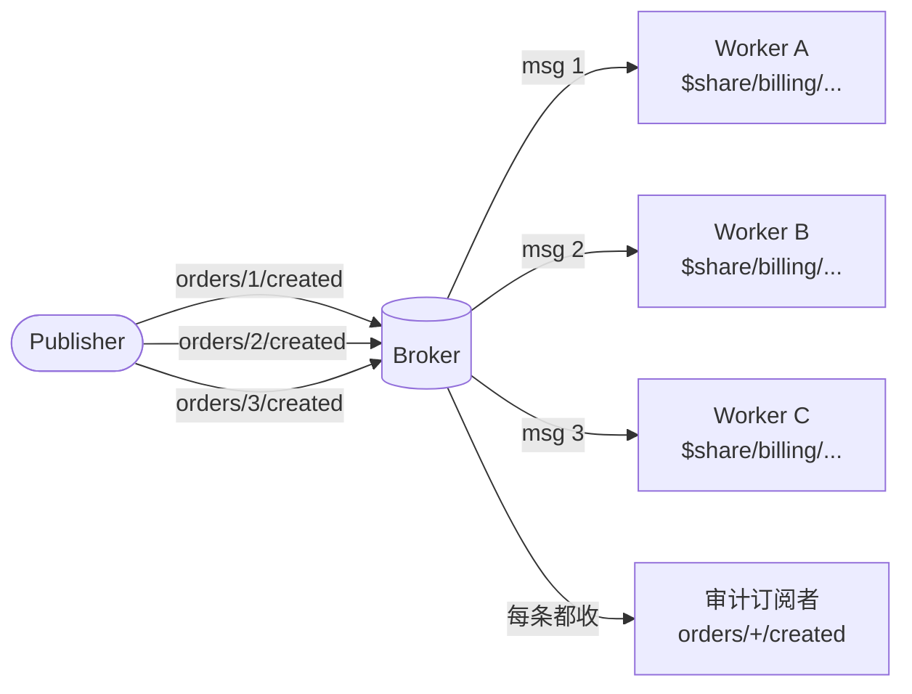

# 共享订阅

mqttkit 在策略层识别 MQTT 5 共享订阅（`$share/<group>/<filter>`）。Broker（Aedes）负责扇出和组内负载均衡；mqttkit 剥离 `$share/<group>/` 前缀后，用真正的 topic filter 去匹配路由，并把 group 透出给订阅策略。

这让你在同一个 MQTT broker 后面部署多副本 mqttkit consumer 不需要任何自定义负载均衡逻辑。

## 扇出行为

普通订阅会扇出给所有订阅者；共享订阅在组内竞争，broker 保证每条消息只发给组内的**一个**成员。



`billing` 组内消息按 broker 自己的策略三选一；普通 `orders/+/created` 审计订阅者每条都能收到。

## 客户端订阅

```ts
import mqtt from 'mqtt'

const client = mqtt.connect('mqtt://broker.example.com:1883')
client.subscribe('$share/billing/orders/+/created')
```

`billing` 组的所有成员一起竞争 `orders/+/created` 的消息。Broker 把每条消息发给组内的**一个**成员。

## 服务端匹配

```ts
router().topic('orders/:id/created', {
  subscribe: ({ shared, principal }) => {
    if (shared) {
      // 限制哪些服务可以做共享订阅
      return ['billing', 'fulfillment'].includes(shared.group)
    }
    return Boolean(principal?.uid)
  },
})
```

- 普通订阅时 `shared` 为 `undefined`。
- `shared.group` 是解析出来的 share name。
- 策略里看到的 `topic` 和 `params` 都来自**剥离前缀后**的过滤器（`orders/+/created`），路由匹配逻辑与普通订阅完全一致。

## 组名校验

`parseSharedSubscription` 遵循 MQTT 5 §4.8.2：

- 组名非空。
- 组名不能包含 `/`、`+`、`#`。
- 组名后的 topic filter 不能为空。

任何不满足规则的输入都会被当作普通订阅处理。

## 手动解析

`parseSharedSubscription` 已经导出，方便你在适配器或审计代码里自己检查：

```ts
import { parseSharedSubscription } from '@mqttkit/core'

parseSharedSubscription('$share/g1/a/+/b') // { group: 'g1', topic: 'a/+/b' }
parseSharedSubscription('a/+/b') // null
```
