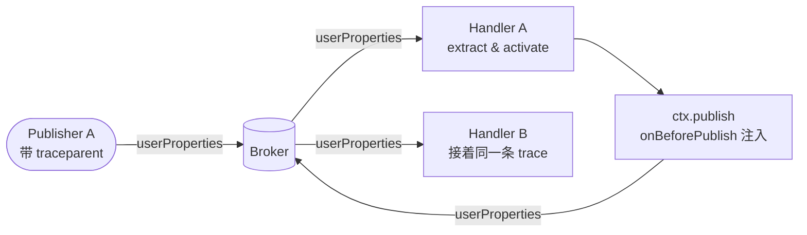

# Tracing 与 User Properties

mqttkit 在入站和出站两侧都暴露了 MQTT 5 user properties，让你不用碰适配器特有的 packet 结构就能接分布式 trace（OpenTelemetry W3C `traceparent`、Datadog `x-datadog-*`、自定义 correlation ID）。

## 入站：`ctx.userProperties`

每个 dispatch context 上都有 `userProperties?: Record<string, string | string[]>`——`packet.properties.userProperties` 的扁平读视图。发布方没带就是 `undefined`。

```ts
router().topic('telemetry/:id', {
  onMessage(ctx) {
    const traceparent = ctx.userProperties?.traceparent
    if (typeof traceparent === 'string') {
      // 交给 OTel propagator…
    }
  },
})
```

## 出站：`app.onBeforePublish(hook)`

hook 在每次 outbound publish 之前立即执行——`app.publish()` 和 `ctx.publish()` / `ctx.reply()` 都会走，因为它们都走同一个 `publish()` 路径。hook 收到的是一个可变视图：

```ts
type MqttBeforePublishContext = {
  topic: string
  payload: MqttPayload
  options: PublishOptions   // 永远是一个浅拷贝
}
```

直接改 `options` 就行，典型做法是合并进 `options.properties.userProperties`：

```ts
app.onBeforePublish((c) => {
  c.options.properties = {
    ...c.options.properties,
    userProperties: {
      ...c.options.properties?.userProperties,
      traceparent: currentTraceparent(),
    },
  }
})
```

hook 按注册顺序执行。抛错会中止 publish，错误通过 `onError` 上报（`phase: 'publish'`），broker 不会被调用。

## OpenTelemetry 示例

OTel 的 W3C 上下文传播底层用 `AsyncLocalStorage`，所以 active context 会沿着 `await` 边界从 handler 流进任何嵌套的 publish。一段入站 middleware（extract + activate）配一段出站 hook（inject），MQTT 往返就跟你的 HTTP / DB span 出现在同一条 trace 上了。

```ts
import { context, propagation, trace } from '@opentelemetry/api'

const tracer = trace.getTracer('mqttkit')

const app = new MqttApp()
  .use(aedes({ tcp: { port: 1883 } }))
  // 入站：extract → 起 span → 把 active context 绑给整个 handler
  .use(async (ctx, next) => {
    const parent = propagation.extract(context.active(), ctx.userProperties ?? {})
    const span = tracer.startSpan(
      `mqtt ${ctx.route?.pattern ?? ctx.topic}`,
      { kind: 1, attributes: { 'mqtt.topic': ctx.topic, 'mqtt.client_id': ctx.clientId } },
      parent,
    )
    try {
      await context.with(trace.setSpan(parent, span), () => next())
    } catch (err) {
      span.recordException(err as Error)
      throw err
    } finally {
      span.end()
    }
  })
  // 出站：把 active context inject 到每一次 publish 的 userProperties 里
  .onBeforePublish((c) => {
    const carrier: Record<string, string> = {}
    propagation.inject(context.active(), carrier)
    if (Object.keys(carrier).length === 0) return
    c.options.properties = {
      ...c.options.properties,
      userProperties: { ...c.options.properties?.userProperties, ...carrier },
    }
  })
  .use(router().topic('devices/:uid/events', {
    async onMessage(ctx) {
      await ctx.publish(`server/${ctx.params.uid}/ack`, 'ok')
    },
  }))
```

因为 `context.with()` 会把 OTel 上下文绑给 await 中的 handler，嵌套的 `ctx.publish()` 自然跑在同一个 active context 里，`onBeforePublish` hook 从 `context.active()` 取到 `traceparent`。两个同样接好 OTel 的 consumer 就能看到一条不断的跨 broker 分布式 trace。

## 往返



## 备注

- hook 故意没传 `ctx`。每请求状态请用 `AsyncLocalStorage` 承载（OTel 自己也是这么做的；自定义 correlation ID middleware 直接用 Node 的 `AsyncLocalStorage` 即可）。
- hook 看到的是解析后的具体 `topic`，看不到 `route.pattern`。如果要给 span 打 route pattern 标签，请在入站 middleware 里做——那里能拿到 `ctx.route?.pattern`。
- `app.request()` 和 `ctx.reply()` 都会走 `app.publish()`，所以 hook 一注册，RPC 的 trace 自动接通。
